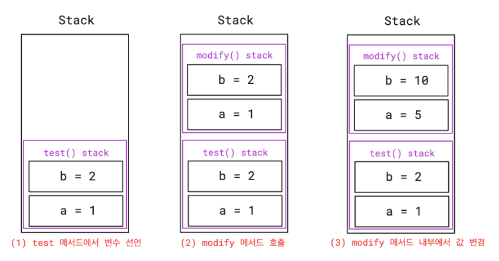

<aside>
🌈 결론부터 말하자면,
**Java 는 오직 Call by Value 로만 동작**

</aside>

- 메서드를 호출할 때 파라미터를 전달하는 방법에는 두 가지
    
    ## 1. **Call by Value**
    
    - 메서드 호출 시, 값을 넘겨줌
    - 메서드를 호출하는 호출자 (Caller) 의 변수와 호출 당하는 수신자 (Callee) 의 파라미터는 복사된 **서로 다른 변수**
    
    ```sql
    public class PrimitiveTypeTest {
    
        @Test
        @DisplayName("Primitive Type 은 Stack 메모리에 저장되어서 변경해도 원본 변수에 영향이 없다")
        void test() {
            int a = 1;
            int b = 2;
    
            // Before
            assertEquals(a, 1);
            assertEquals(b, 2);
    
            modify(a, b);
    
            // After: modify(a, b) 호출 후에도 값이 변하지 않음
            assertEquals(a, 1);
            assertEquals(b, 2);
        }
    
        private void modify(int a, int b) {
            // 여기 있는 파라미터 a, b 는 이름만 같을 뿐 test() 에 있는 a, b 와 다른 변수
            a = 5;
            b = 10;
        }
    }
    ```
    
    - 원시 타입은 stack영역에 위치
    메서드 호출시 넘겨받는 파라미터들도 원시타입이라면 stack영역에 생성
    - `test()` 의 변수 `a`, `b` 와 `modify(a, b)` 로 전달받은 파라미터 `a`, `b` 의 이름과 값은 같지만 다른 변수
    - modify(a,b)호출시, Stack영역에 새로운 변수 a,b가 새로 생성되어 총 4개의 변수가 존재
        
        
        
    
    ⇒ modify의 영역에 값을 바꿔도 test() 영역의 변수는 변화가 없다. 원시 타입의 전달은 값만 전달하는 call by value()
    
    ## 2. **Call by Reference**
    
    - 참조 (주소) 를 직접 전달
    - 참조를 직접 넘기기 때문에 호출자의 변수와 수신자의 파라미터는 **완전히 동일한 변수**